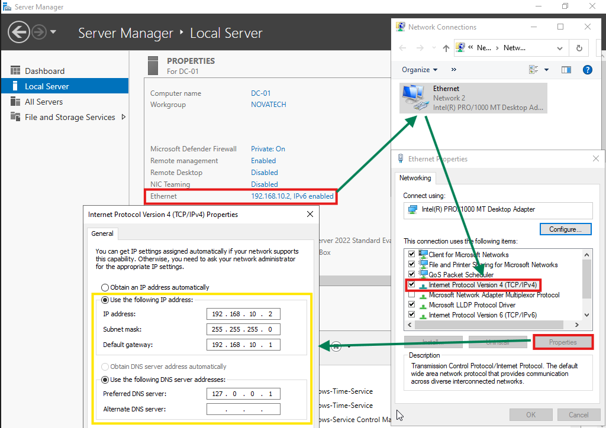
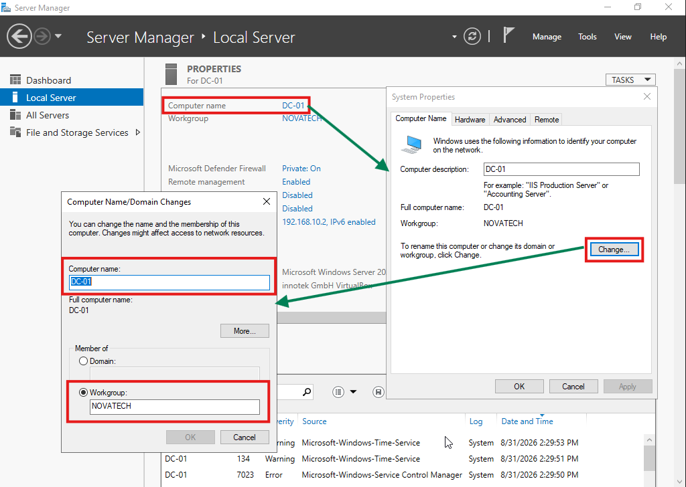
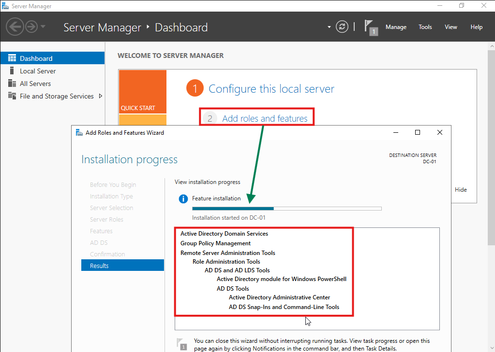
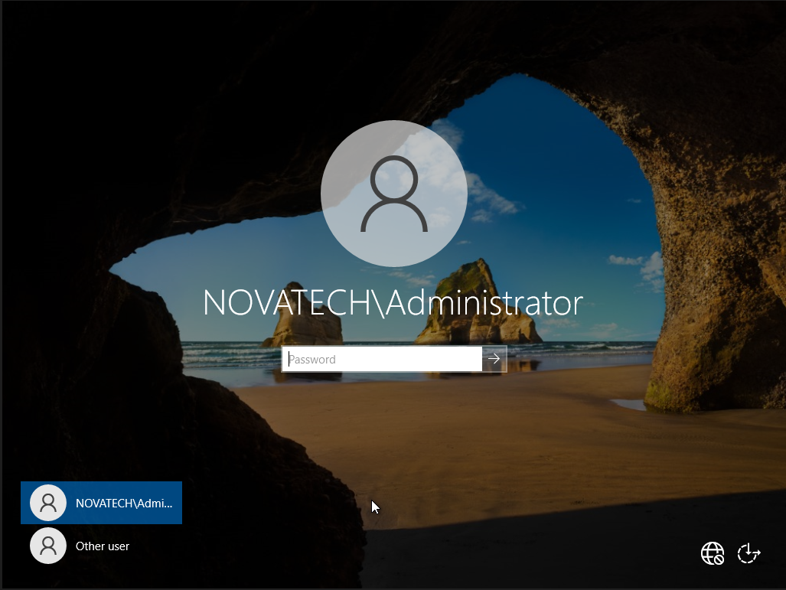
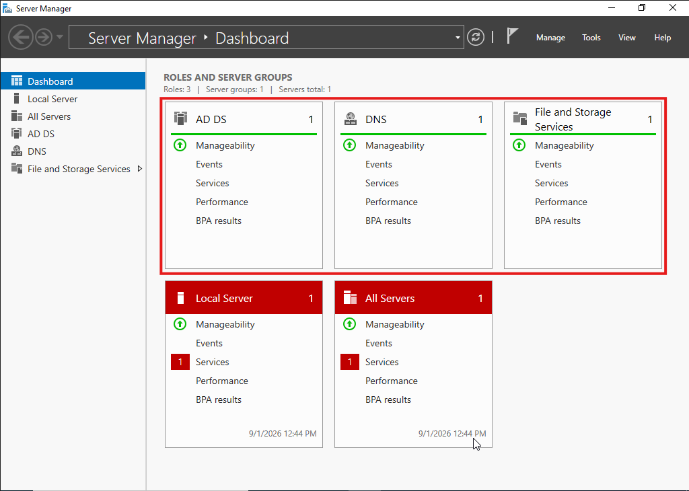
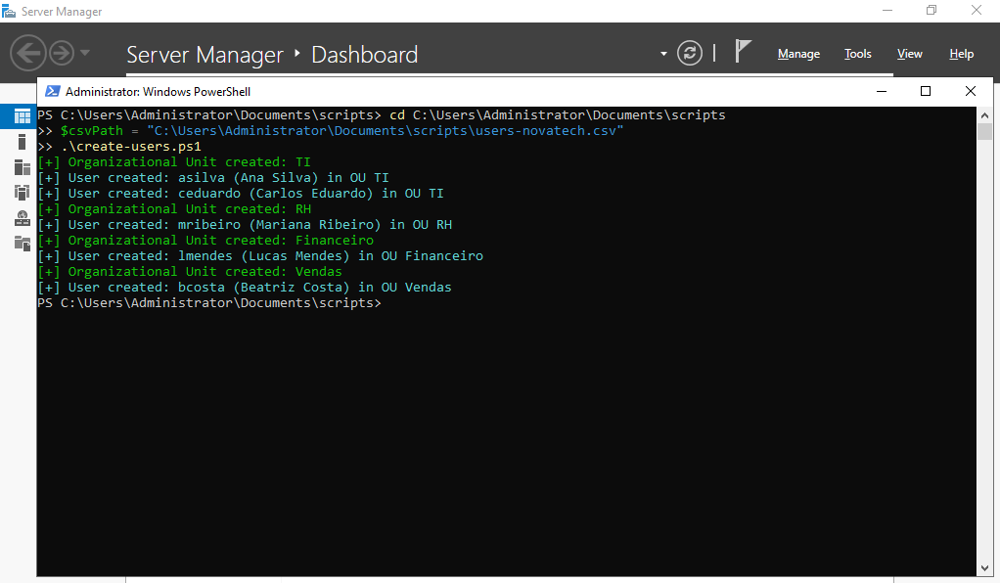
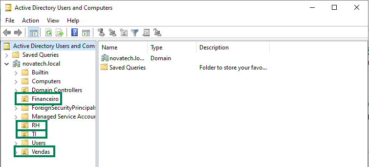
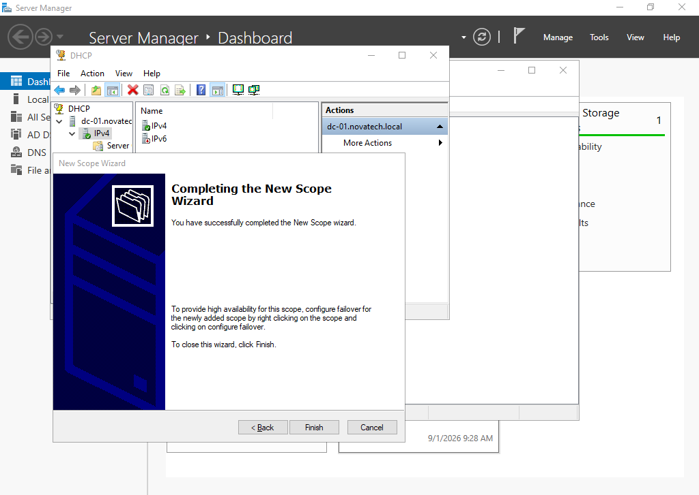
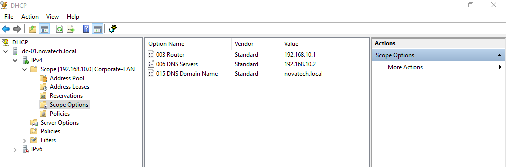

# Phase 1: Foundation (Windows Server, AD DS, DNS, DHCP & Automation)

## 1. Environment Specifications
- **VM Name:** DC-01
- **OS:** Windows Server 2022 Standard Evaluation (Desktop Experience)
- **RAM:** 2560 MB (2.5 GB)
- **vCPU:** 2 Cores
- **Disk:** 50 GB (Dynamic)
- **Network Mode:** NAT Network (`Rede-Corporativa`)
- **IP Address:** 192.168.10.2 /24
- **Gateway:** 192.168.10.1
- **DNS:** 127.0.0.1 (Loopback)
- **Domain:** novatech.local

---

## 2. Step 1: VM Provisioning & OS Installation
- Configured a dedicated NAT Network (`Rede-Corporativa`) with range `192.168.10.0/24` on VirtualBox.
- Created VM `DC-01` with 2 vCPUs and 2.5 GB RAM.
- Installed Windows Server 2022 Standard Evaluation with Desktop Experience (GUI).

---

## 3. Step 2: Server Identity & Static IP Configuration
- Renamed the server hostname to **`DC-01`**.
- Configured static IPv4 address parameters on the primary network adapter:
  - **IP Address:** `192.168.10.2`
  - **Subnet Mask:** `255.255.255.0`
  - **Default Gateway:** `192.168.10.1`
  - **Primary DNS:** `127.0.0.1` (Loopback for local DNS role)

### Evidence & Documentation


*Figure 1.1: Static IPv4 address and DNS server assignment.*


*Figure 1.2: Server hostname changed to DC-01.*

---

## 4. Step 3: Active Directory Domain Services (AD DS) & Forest Creation
- Installed the **Active Directory Domain Services (AD DS)** and **DNS Server** roles on `DC-01`.
- Promoted the server to a Primary Domain Controller, initializing a new Active Directory forest named **`novatech.local`**.
- Configured Directory Services Restore Mode (DSRM) credentials and confirmed NetBIOS domain name assignment as **`NOVATECH`**.
- Validated automatic DNS zone creation and Global Catalog (GC) designation.

### Evidence & Documentation


*Figure 1.3: Completion of the AD DS role installation wizard.*


*Figure 1.4: Server login prompt reflecting the domain context (NOVATECH\Administrator).*


*Figure 1.5: Server Manager dashboard confirming active AD DS and DNS operational states.*

---

## 5. Step 4: Active Directory User & OU Automation via PowerShell
- Designed an automated user provisioning script using PowerShell (`create-users.ps1`) and a structured CSV data source (`users-novatech.csv`).
- Automated organizational structure creation by dynamically provisioning Organizational Units (OUs) based on corporate departments (`TI`, `RH`, `Financeiro`, `Vendas`).
- Configured user account attributes including SAM Account Names, User Principal Names (UPNs - formatted for internal Active Directory authentication), job titles, department tags, temporary default passwords, and forced password reset on first logon (`ChangePasswordAtLogon`).

### Evidence & Documentation


*Figure 1.6: Execution output of the PowerShell provisioning script confirming OU and user account creation.*


*Figure 1.7: Active Directory Users and Computers (dsa.msc) displaying the newly generated OUs and populated user objects.*

---

## 6. Step 5: DHCP Server & DNS Forwarder Configuration
- Installed and authorized the **DHCP Server** role on `DC-01` within Active Directory.
- Created and activated a primary IPv4 scope named **`Corporate-LAN`**:
  - **Network ID:** `192.168.10.0/24`
  - **Dynamic Distribution Range:** `192.168.10.50` to `192.168.10.150`
  - **Subnet Mask:** `255.255.255.0`
- Provisioned essential DHCP Scope Options for network clients:
  - **Option 003 (Router / Default Gateway):** `192.168.10.1`
  - **Option 006 (DNS Servers):** `192.168.10.2` (`DC-01`)
  - **Option 015 (DNS Domain Name):** `novatech.local`
- **DNS External Forwarders:** Configured Google Public DNS (`8.8.8.8`) as external forwarder in DNS Manager (`dnsmgmt.msc`) to allow internal domain clients to resolve public internet domains while maintaining local Active Directory name resolution.

### Evidence & Documentation


*Figure 1.8: Successful completion of the New Scope Wizard on DC-01.*


*Figure 1.9: DHCP console (dhcpmgmt.msc) displaying active Corporate-LAN scope and options.*

---

## 7. Troubleshooting & Lessons Learned

### Issue 1: PowerShell Script Execution Policy Restriction
- **Symptom:** Running `.\create-users.ps1` was blocked with an execution policy error.
- **Root Cause:** Default Windows Server PowerShell execution policy restricts untrusted local script execution.
- **Resolution:** Temporarily set execution policy to RemoteSigned for the administrative session:
```powershell
  Set-ExecutionPolicy RemoteSigned -Scope Process
```
  `RemoteSigned` was chosen over `Unrestricted` or `Bypass` to maintain a minimum security baseline — it still requires signature validation for scripts downloaded from external sources, while allowing locally created unsigned scripts (like this one) to execute.

### Issue 2: Clipboard & Guest Integration on Initial Setup
- **Symptom:** Inability to copy/paste configuration files and scripts directly into the guest VM filesystem.
- **Root Cause:** VirtualBox Guest Additions drivers were missing, disabling bidirectional shared clipboard functionality.
- **Resolution:** Mounted `VBoxGuestAdditions.iso` via VirtualBox optical drive, installed drivers on `DC-01`, and initiated system reboot. Alternatively, generated scripts directly using PowerShell stream redirectors (`Out-File -Encoding utf8`).

---

## 8. Phase 1 Completion Summary
Phase 1 establishes a fully functional, enterprise-grade Infrastructure Base:
1. **Core Networking & Identity:** `DC-01` operates as the primary Domain Controller, Global Catalog, and DNS Server for `novatech.local`.
2. **Automated IAM Baseline:** Organizational Units and user accounts provisioned through modular PowerShell scripts (`create-users.ps1`).
3. **Automated IP Addressing & Resolution:** DHCP server configured for dynamic IP assignment and DNS forwarders ready for outbound internet traffic.